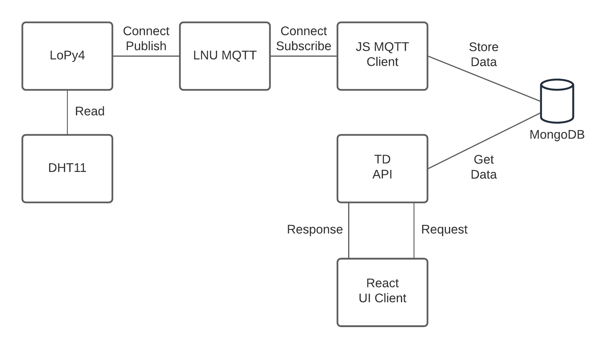

# Assignment 3 - IoT Project

## Project description

In this assignment you will create a small IoT-project where a "thing" will be connected to internet through web technologies. 

## Requirements

### For Passing grade
* The "thing" should have a simple UI where it is possible to try it´s functionality. 
* The "thing" should at least have "properties" or "actions" or "events" or any combination of the three. 

### For higher grade
* The "thing" should be described using the W3C WoT Thing Description

The UI can be a free standing web UI, slack commands, graphan UI or what ever suits your needs. The UI should, if possible, be accesseble for the course management.

## Hand in of the assignment

To hand in this assignemnt you should create a Merge Request from this repos "master"-branch to the "release"-branch. When you create the MR you should:
1) Complete the Assignment report given.
2) Set the correct Milestone for the hand in. (Look at the deadline date)

## Questions to be answered in the Assignment Report:

The following questions should be answerded when creating the MR.

### Describe the thing

General structure shown here.
LoPy4 with a connected DHT11 sensor.
The LoPy4 is connected to a mqtt broker, which it can publish the sensor data to.

I have a node js server with a mqtt client, subscribing to the same topic as it is published to. The sensor data is then saved in a MongoDB. This node js server also hosts the TD API which can get the documents saved of MongoDB.

A React UI Client asks the API for the most recent data every 60s and displays it on a very simple dashboard.

### Functionality

- [TD API](https://ol222hf-iot-api.herokuapp.com/things/lil-opy-iv)
- [Thing UI](https://ol222hf-iot-ui.herokuapp.com/)
- [URL to recording](https://youtu.be/wZ1ageZpq3k)

If possible we want a public url to visit to check the IoT-thing.

You need to provide a recording of your thing and how it works. Talk about:
    
* The thing, hardware
* Connectivity, how is the thing connected?
* Integration and UI

### Group/individual reflection
 
I struggled with hardware a lot. I didn't get my sensors to give me values, I had issues with getting WiFi to work. So much of my time was just trying things and problem-solving. The hardest part is not only having to think about the code, but the real-life factors such as defect hardware or human error on connecting sensors.

I would have liked to work with more sensors, expand my TD API to allow for fetching more values over a period of time, maybe introduce pagination as well to help with that. 

But I learned a lot from having to work through issues! From having never worked with hardware before, I now feel like a have a solid foundation and understanding of how things communicate.

### Further improvements

This is more or less the same answer as above. I would have liked more sensors. Readign Co2 levels would have been fun, as well as other factors such as lighting.

I would also have liked to expand my TD API more as specified earlier. Maybe add events to the TD API as well, as every climate reading should be some form of event in my mind.

### Extras

The main things I have gone for is the structure of my JSON responses from my TD API, as well as including properties.

### Feedback

Fun course! I think the focus could be narrowed. Maybe do as was done in the summer course were we as students get a "package" to buy so we know that the hardware we purchase is all compatible.
